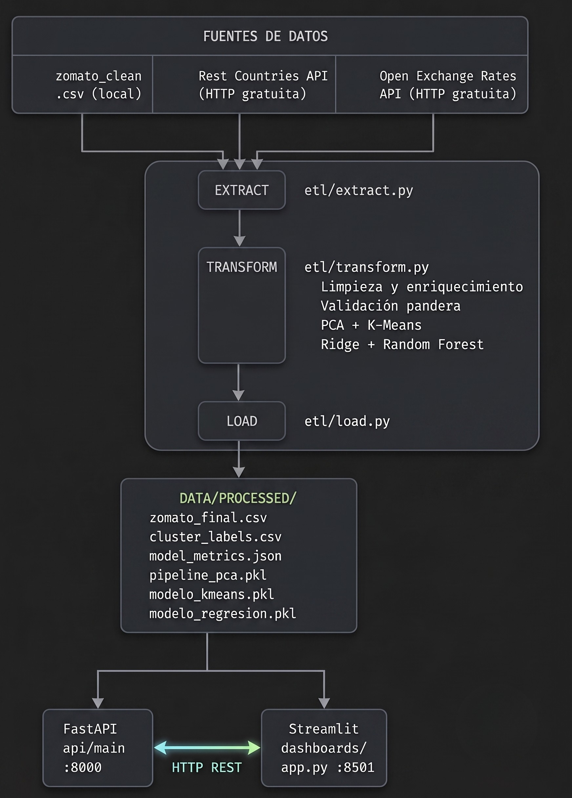

# Arquitectura del Sistema — Zomato Analytics

## Diagrama general

A continuación se representa el flujo conceptual general. Se incorpora un diagrama formal exportado en `/docs/imagenes/arquitectura_macro.png` el cual ilustra el aislamiento entre contenedores Docker de este entorno de producción.



```
┌─────────────────────────────────────────────────────────────────┐
│                        FUENTES DE DATOS                         │
├─────────────────┬──────────────────────┬────────────────────────┤
│  zomato_clean   │  Rest Countries API  │  Open Exchange Rates   │
│  .csv (local)   │  (HTTP gratuita)     │  API (HTTP gratuita)   │
└────────┬────────┴──────────┬───────────┴────────────┬───────────┘
         │                   │                        │
         └───────────────────▼────────────────────────┘
                        ┌──────────┐
                        │ EXTRACT  │  etl/extract.py
                        └────┬─────┘
                             │
                        ┌────▼─────┐
                        │TRANSFORM │  etl/transform.py
                        │          │  - Limpieza y enriquecimiento
                        │          │  - Validación pandera
                        │          │  - PCA + K-Means
                        │          │  - Ridge + Random Forest
                        └────┬─────┘
                             │
                        ┌────▼─────┐
                        │   LOAD   │  etl/load.py
                        └────┬─────┘
                             │
              ┌──────────────▼──────────────┐
              │       data/processed/        │
              │  zomato_final.csv            │
              │  cluster_labels.csv          │
              │  model_metrics.json          │
              │  pipeline_pca.pkl            │
              │  modelo_kmeans.pkl           │
              │  modelo_regresion.pkl        │
              └──────────┬──────────────────┘
                         │
           ┌─────────────┴──────────────┐
           │                            │
    ┌──────▼──────┐             ┌───────▼───────┐
    │  FastAPI    │             │   Streamlit   │
    │  api/main   │◄────────────│  dashboards/  │
    │  :8000      │  HTTP REST  │  app.py :8501 │
    └─────────────┘             └───────────────┘
```

## Componentes

### 1. Pipeline ETL (`etl/`)

| Archivo | Responsabilidad |
|---|---|
| `extract.py` | Carga las 3 fuentes de datos con manejo de errores |
| `transform.py` | Limpieza, validación, PCA, K-Means, Ridge, Random Forest |
| `load.py` | Guarda CSV, JSON de métricas y modelos `.pkl` |
| `pipeline.py` | Orquestador: ejecuta Extract → Transform → Load |

**Flujo de transformación:**
1. Limpieza de `approx_cost` (eliminar comas, convertir a float)
2. Enriquecimiento: `costo_usd` = `approx_cost × tasa_INR_USD`
3. Enriquecimiento: columnas `pais_region`, `pais_moneda`, etc.
4. Validación de esquema con `pandera`
5. PCA al 95% de varianza explicada
6. K-Means optimizado con GridSearchCV + RandomizedSearchCV
7. Ridge Regression + Random Forest para predicción de `rate`

### 2. API RESTful (`api/`)

Construida con **FastAPI**. Documentación automática en `/docs`.

| Endpoint | Método | Descripción |
|---|---|---|
| `/` | GET | Estado de la API |
| `/clusters` | GET | Perfil de cada cluster |
| `/metricas/clustering` | GET | Silhouette, CH, DB, Inercia |
| `/metricas/regresion` | GET | RMSE, MAE, R² de ambos modelos |
| `/predecir/rate` | POST | Predice rating de un restaurante |
| `/predecir/cluster` | POST | Predice cluster de un restaurante |

### 3. Dashboard (`dashboards/`)

Construido con **Streamlit + Plotly**. Dos audiencias:

- **Vista de Negocio:** segmentos en lenguaje simple, explorador de restaurantes, simulador de rating con gauge visual
- **Vista Técnica:** scatter PCA 2D, métricas de clustering, comparativa R²/RMSE, distribuciones de variables

### 4. Contenedores Docker (`docker/`)

| Servicio | Imagen base | Puerto |
|---|---|---|
| `etl` | python:3.11-slim | — (corre y termina) |
| `api` | python:3.11-slim | 8000 |
| `dashboard` | python:3.11-slim | 8501 |

Los servicios comparten datos a través de un **volumen Docker** llamado `processed_data`.

## Decisiones de diseño

- **Fallback en APIs externas:** si Rest Countries o Exchange Rates fallan, el pipeline usa valores por defecto y continúa sin abortar
- **Logging profesional:** todos los módulos usan `logging` (no `print`), con salida a consola y archivo `etl.log`
- **Modelos serializados:** los `.pkl` permiten que la API cargue los modelos sin re-entrenar
- **Validación con pandera:** garantiza integridad del esquema antes de entrenar modelos
